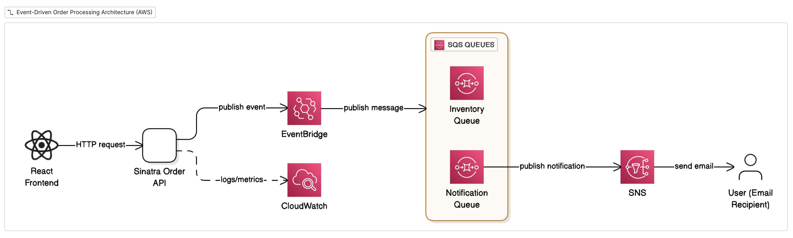
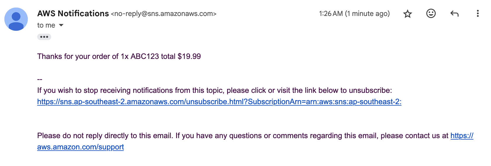

# Ruby Event-driven Services with AWS EventBridge and SQS

A simple tutorial demonstrating how to build event-driven services in Ruby using AWS EventBridge and SQS. It uses a simple Sinatra app to create orders and publish events to EventBridge. The events are then consumed by worker services (notification and inventory).



The `resources` folder contains Terraform code to set up the necessary AWS infrastructure.

The `services` folder contains the following services:
- `order_service`: A Sinatra app to create orders and publish events to EventBridge.
- `notification_service`: A worker service that consumes order events from SQS and sends notifications.
- `inventory_service`: A worker service that consumes order events from SQS and updates inventory.

The `client` folder contains a simple Vite + React app to interact with the `order_service`.

You can subscribe to the SNS topic to receive notifications via email or SMS.



## Development

```shell
docker-compose up --build
```

Visit `http://localhost:5173/` for the client app.

## Deployment

### Build Docker Image

```shell
docker-compose -f docker-compose.yml up --build
```

### With Terraform

```shell
AWS_PROFILE=pamit terraform init
AWS_PROFILE=pamit terraform plan
AWS_PROFILE=pamit terraform apply
```

## Notes

### LocalStack

**Not working currently, ignore these instructions.**

For local development, you can use [LocalStack](https://localstack.cloud/) to simulate AWS services locally. Make sure to configure your AWS SDK to point to LocalStack endpoints.

There's a script in `localstack-init/create-queues.sh` that automatically creates the necessary SQS queues when LocalStack starts. This script is mounted into the LocalStack container and executed on startup.

- Creating queues manually:
  ```shell
  docker-compose exec localstack awslocal sqs create-queue --queue-name inventory-queue
  docker-compose exec localstack awslocal sqs create-queue --queue-name notification-queue
  ```
